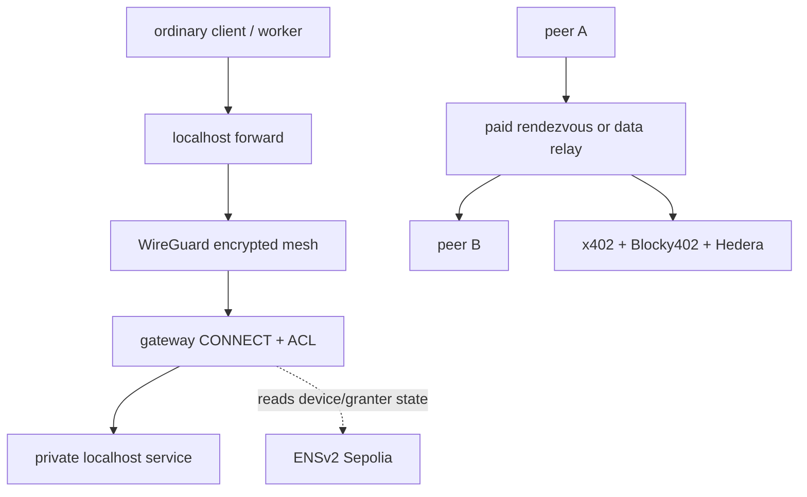

# Bramble

Bramble gives devices and automated workers private network access without making a coordination server the authority. Device identities, revocation, and scoped service grants live in an ENSv2 subname registry. Every WireGuard peer resolves that registry independently before accepting another peer. Public relay operators can be discovered through ENS and paid for rendezvous or byte allotments through x402 on Hedera.

The hackathon demo is one concrete access lifecycle: a thin health-check worker reaches an internal HTTP task API through a Bramble forward, an ungranted request is denied, a human-approved on-chain ACL expansion makes the identical request succeed without a restart, and revoking the worker removes it from the gateway's WireGuard peer table.

## Why the integrations matter

- **ENSv2** is the authorization source. Permissioned registries, per-name resolvers, and Enhanced Access Control separate enrollment, rotation, revocation, ACL, and relay-registration rights.
- **Ledger** gates two different things physically, on real hardware: enrolling a new device is signed directly by the device itself (a from-scratch `@ledgerhq/hw-app-eth` signer, since `wallet-cli send` doesn't support Sepolia), and the administrator's ACL-granting key lives encrypted under a Key Ring, decrypted headlessly per grant, never as plaintext. Full status, hardware findings, and Ledger DX feedback are documented in [ADR 0001](docs/adr/0001-ledger-ring-vs-send-split.md) and [Ledger DX feedback](docs/12_LEDGER_DX_FEEDBACK.md).
- **Hedera** settles x402 payments through Blocky402 for relay access. Rendezvous uses a fixed session fee; data relays sell explicit byte allotments at a published price.

## Architecture



The relay can affect availability but does not decide admission: a peer only configures a WireGuard public key after resolving an authorized ENS record. Device records contain public keys and authorization state, not IP addresses. Relay endpoints live in a separate relay registry.

The runtime is split into five small programs:

- `brambled/`: per-node WireGuard daemon, admission loop, gateway, local forwards, relay selection and recovery.
- `sidecar/`: loopback-only ENS and payment client used by one node.
- `relay/` and `relay-sidecar/`: rendezvous/data forwarding plus public x402 resource server.
- `admincli/`: ENSv2 enrollment, role, key, ACL, and relay-registry writes.
- `dashboard/`: read-only device and relay view. Its server exposes only explicit GET routes and cannot forward payment calls.

See [the architecture document](docs/03_ARCHITECTURE.md) and [ADRs](docs/adr/) for trust boundaries and rejected alternatives.

## Install and verify

Requirements: Node.js 22, pnpm 10, Bun, and Go 1.27.

```sh
pnpm install --frozen-lockfile
pnpm verify
pnpm test:access-flow
```

`test:access-flow` runs a rootless, deterministic integration test with real userspace WireGuard nodes and real TCP proxying. It exercises an allowed private task, denial outside scope, a live capability expansion, the identical newly-allowed task, and device revocation. Its resolver is in-memory; live ENS transactions and two-machine behavior are separately recorded in the [node runbook](brambled/README.md).

The dashboard is part of the root pnpm workspace and Turbo graph:

```sh
pnpm dev:dashboard
pnpm --filter @bramble/dashboard verify
```

## Configuration

Copy secrets into an ignored `.env` file or the process environment. Never commit values.

| Variable                              | Used by              | Purpose                                                             |
| ------------------------------------- | -------------------- | ------------------------------------------------------------------- |
| `BRAMBLE_TAILNET_NAME`                | node/admin tools     | Full ENS tailnet name                                               |
| `BRAMBLE_TAILNET_REGISTRY`            | node/admin tools     | ENSv2 device registry address                                       |
| `BRAMBLE_RELAY_REGISTRY`              | node/dashboard       | Separate relay registry address                                     |
| `BRAMBLE_RELAY_REGISTRY_DEPLOY_BLOCK` | node/dashboard       | First block to scan for relay labels                                |
| `BRAMBLE_PRIVATE_KEY`                 | node                 | This node's WireGuard private key                                   |
| `SEPOLIA_RPC_URL`                     | ENS clients          | Optional Sepolia RPC override                                       |
| `SEPOLIA_PRIVATE_KEY`                 | admin tools          | Software signer for commands that have not yet been moved to Ledger |
| `HEDERA_CLIENT_ACCOUNT_ID`            | node payment sidecar | Testnet payer account                                               |
| `HEDERA_CLIENT_PRIVATE_KEY`           | node payment sidecar | Testnet payer key                                                   |
| `HEDERA_MAX_PAYMENT_ATOMIC`           | node payment sidecar | Per-payment ceiling; defaults to 100,000 atomic USDC (0.10 USDC)    |

`brambled serve` also applies `-max-relay-price-per-byte` and `-max-relay-session-cost` before purchasing a data-relay session. See [brambled's command reference](brambled/README.md) and the package READMEs for the full launch flags.

## Demo path

1. Start a private backend on the gateway, for example `(cd brambled && go run ./cmd/demo-service -port 9100)`.
2. Start registered gateway and worker nodes using the two-machine commands in the [client-forwarding runbook](brambled/README.md#client-forwarding-runbook--an-unmodified-client-through-a-real-gateway). Give the gateway `-service web=9100`; give the worker `-forward 8080=gateway-label:web`.
3. Run `(cd brambled && go run ./cmd/demo-agent -url http://127.0.0.1:8080/task)`. The worker has no backend credential, and the request fails while it lacks the matching ACL digest.
4. Trust the granter on the gateway with `pnpm --dir admincli set-acl-granters -- <gateway-label> <granter-label>`, then grant the service with `pnpm --dir admincli set-acl -- <worker-label> <gateway-label> <granter-label> web`. The identical agent command prints a private-service health result without restarting either node.
5. Revoke the worker with `pnpm --dir admincli revoke -- <worker-label> true`. The gateway removes it on its next ENS poll and the task fails at the tunnel boundary.

For the recorded demo, the ACL write should use the Ledger-backed path once Gate 3 is complete. Until then, describe the admin commands above as software-signed ENS writes.

The paid relay proof is run separately with `brambled demo-data-relay`; it prints the Hedera settlement transaction IDs for differently sized sessions and for pre/post-failure relay selection. See [relay-sidecar's runbook](relay-sidecar/README.md).

## Payment flow

1. A node discovers relay labels and public payment URLs from the ENS relay registry.
2. It requests a rendezvous token or data-relay byte allotment from a relay-sidecar.
3. The relay-sidecar responds with x402 payment requirements.
4. The node sidecar signs a Hedera testnet USDC payment, subject to its configured atomic cap, and retries the request.
5. Blocky402 verifies and settles the payment. The resource server returns a one-use rendezvous token or ephemeral UDP relay session and Bramble prints the settlement ID.

## Evidence and limitations

The [build plan](docs/05_BUILD_PLAN.md) links the adversarial tests, live Sepolia transactions, two-machine runs, physical Ledger findings, and Hedera settlement IDs. The measured already-connected revocation time was 3.7 seconds with a five-second poll interval and a responsive resolver.

This is a hackathon prototype. STUN and automatic hole-punch failure detection are not implemented; relay use is selected explicitly for the demo topology. Mesh IPs and peer labels remain operator-supplied. Relay sessions use first-two-source UDP learning, do not handle NAT remapping, and expire after five minutes. A node key is an ordinary software key and can be copied while authorized. The payer is likewise a software key. ENS/RPC availability, administrator authority, host security, and relay availability remain dependencies.

## Open source and AI usage

Licensed under the MIT License. Third-party libraries and starter code retain their own licenses. AI assistance and the human-directed design trail are disclosed in [AI usage](docs/AI_USAGE.md).
