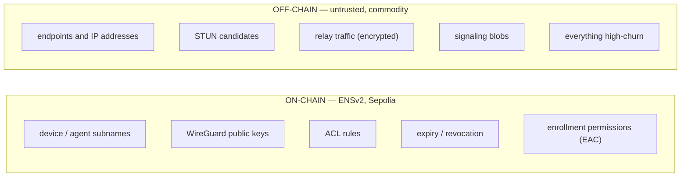
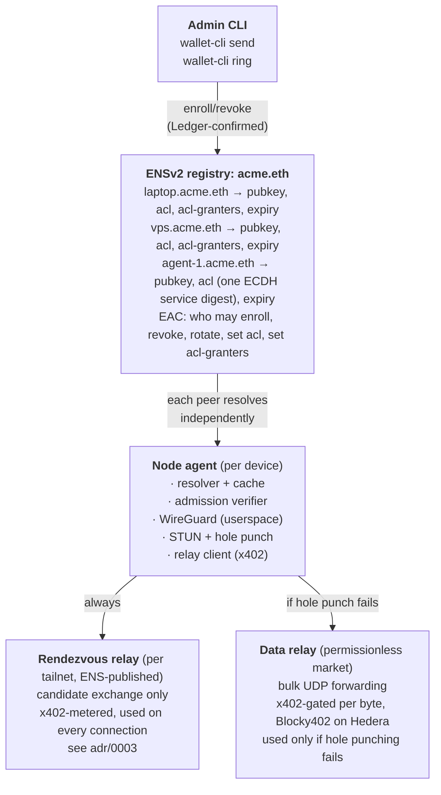

# Architecture

## The boundary that defines the project

**Nothing that reveals a mesh member's network topology goes on-chain.** Device and agent subnames — the things admission control gates — never carry an endpoint, IP, or port. This is a hard rule, not a preference — see `09_JUDGING.md`, objection 2. It extends to ACLs too: a device's `acl` record holds ECDH digests of symbolic service names (each one a Diffie-Hellman shared secret between the vouching identity's and the target device's already-published pubkeys, never a manually-shared secret), never a name, host, or port in the clear — see `adr/0005-acl-record-schema.md`.

**Relays are the deliberate exception, not a loophole.** A relay is not a mesh member; it's a permissionless, publicly-reachable commodity service with no admission gate to leak, so advertising where it lives is a feature — it's how clients and other agents find it (see "Relay economics" below) — not a security regression. The rule that matters is *"never publish where a private mesh member lives,"* not *"never publish an endpoint anywhere."* Conflating the two either leaks topology or throws away a real discoverability feature. See `11_SOURCE_NOTES.md` for why this came up.

## Components

## The admission model (the thesis)

Every peer, before completing a WireGuard handshake with an unknown public key:

1. Resolve the tailnet registry from ENSv2 (cached, TTL'd).
2. Check the presenting key exists as an authorized device, is not expired, and is not revoked.
3. Check the ACL permits the requested destination.
4. Only then complete the handshake.

`HARD RULE` — this check happens **at the peer**. Not at a relay, not at a coordinator, not at any central service. If anything central performs the check, a compromised central service can lie, and the entire project is theatre.

## Signaling, stated precisely

NAT hole-punching requires two peers to exchange candidates at roughly the same time. Something must carry that exchange, before any direct connection exists — a coordinator would normally be that channel, but this project doesn't have one. See `adr/0003-rendezvous-relay-split.md` for the full reasoning, with a plain-language WireGuard/NAT recap and a worked example.

**Two relay roles, not one, and two very different usage rates:**

- **Rendezvous relays** carry the candidate exchange. A small, fixed *set* (more than one — see below) per tailnet, published in ENS, that every member keeps light presence on. Used on **every** connection attempt, hole-punch success or not — there's no way to skip this step, since it's how the two sides learn each other's address in the first place.
- **Data relays** carry the actual WireGuard traffic, only when hole punching fails. Permissionless, price/latency-chosen market, exactly as originally designed.

Both are relays in the same sense: they forward opaque blobs, cannot inject a device (admission is checked against ENS at each peer), and cannot read traffic (WireGuard encrypts end to end; the tiny signaling payload is likewise opaque to the rendezvous relay).

**A rogue rendezvous relay can deny, not impersonate.** It can withhold or lie about an address, but a peer's WireGuard handshake is addressed to a public key it already has from ENS, and only completes if the other end holds the matching private key — a substituted address just produces a failed handshake, never a compromised one. The one real residual risk is *selective* connectivity denial for a targeted pair, which is why the rendezvous set must have more than one relay with failover across it, not just one. Full argument in `adr/0003-rendezvous-relay-split.md` ("Trust boundary") and `09_JUDGING.md` objection 14.

**So the honest claim is "no *trusted* coordinator," not "no infrastructure."** Relays exist, they are commodity, interchangeable, permissionless, and paid per byte. That distinction must survive into the README and the video verbatim. Overclaiming here is the fastest way to lose credibility with a networking-literate judge.

## Relay economics

- Any operator runs a relay and advertises it (an ENS subname is a natural directory, and Hedera awards extra points for agent-discoverable directories). A relay's ENS record is the one place in this project an ENSIP-26 endpoint text record belongs — it's a public service by design, so publishing where it lives is the directory feature, not a leak.
- Clients pick a data relay on price and latency, pay per byte via x402 through Blocky402 on Hedera.
- **Rendezvous relay usage is x402-metered too**, even though the payload is tiny. This isn't about the revenue — it's about guaranteeing every single connection attempt produces a real, on-chain, metered payment, independent of whether that connection ever needed a data relay. Without this, a topology where hole punching just works every time (e.g. a laptop connecting to a VPS, which has no NAT to punch through at all) would generate zero paid relay activity, which is a weak position for a track that specifically wants to see metered, repeated settlement. See `adr/0003-rendezvous-relay-split.md`.
- Relays see only ciphertext. This is why permissionless relays are safe.
- More relays improves geographic coverage, blocking resistance (a fixed set of DERP IPs is easy to firewall; many independent operators is not), and redundancy. **It is not a network effect** and must not be described as one. See `09_JUDGING.md`.

## The agent path

An agent on a VPS or CI runner:

1. An already-enrolled identity, trusted by the destination host's own `acl-granters` list, vouches for `agent-1.acme.eth` to reach exactly one symbolic service name — published on-chain only as an ECDH digest, never the name itself (see `adr/0005-acl-record-schema.md`) — with a short expiry. Confirmed on the Ledger: the granter's ACL-capability key is itself encrypted at rest under `wallet-cli ring` on the admin's machine (see `adr/0001`'s "Pivot" section — same-host by design, not shipped to any headless host), and the grant transaction is signed via `wallet-cli send` with physical on-device confirmation.
2. If the agent later needs more than its current grant, the same loop runs live: the out-of-scope request is denied and logged by the gateway, the admin approves a wider grant on the physical device, and the agent's identical retry succeeds on the next attempt — no restart, since ACL state is resolved fresh on every request.
3. The agent reaches only what its ACL permits. Every peer enforces this independently.
4. Revocation from the admin's wallet cuts it off; peers drop the connection on next resolve.

The agent never holds a transferable credential. A stolen node key is useless off that host and worthless once revoked.

## What is deliberately not built

- No DERP-compatible protocol, no Tailscale client compatibility.
- No SSO, SCIM, posture checks, or audit exports. That is the enterprise feature set this explicitly does not target.
- No exit nodes, no subnet routers, no MagicDNS.
- No deep NAT traversal parity with Tailscale. Symmetric-NAT cases fall back to relay.
